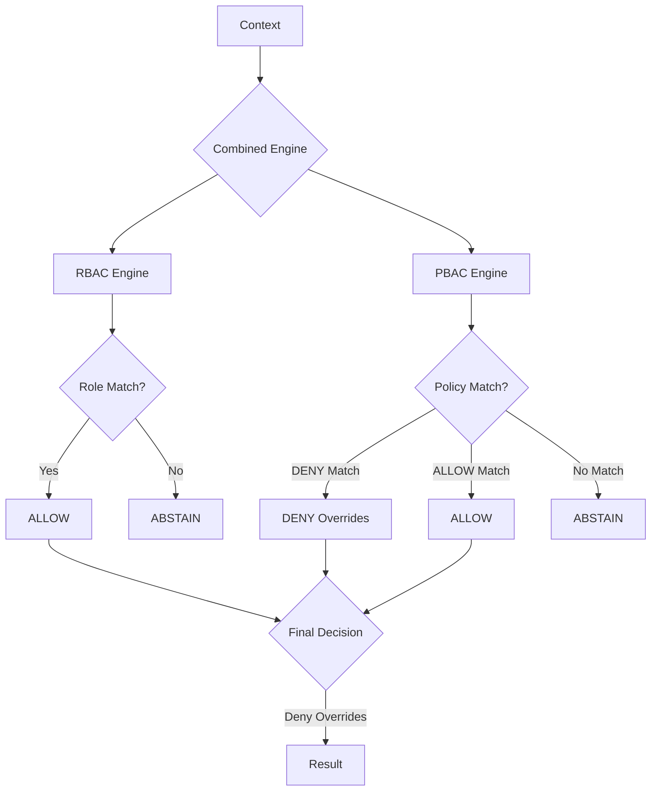

# @vynelix/authz-core

A production-grade, framework-agnostic authorization SDK with RBAC and PBAC support. Designed for sub-microsecond latency and high-throughput environments.

## Architecture

AuthZ uses a "Dual-Engine" approach, combining hierarchical roles (RBAC) with fine-grained attribute policies (PBAC).



## Features

- **RBAC Engine**: Simple role hierarchy resolving multiple inheritance into static O(1) lookups.
- **PBAC Engine**: Fluent policy builder (`policy('post.update').when(...)`) providing fine-grained access control.
- **Decision Engine**: Combines RBAC and PBAC with `Deny-overrides-Allow` logic.
- **High Performance**: 
  - **Policy Indexing**: Grouped policy evaluation targets specific actions, avoiding linear scans.
  - **Memoization**: Per-request caching ready for high-load cycles.
- **Audit Hooks**: Hook into the authorization lifecycle via `onPreAuth` and `onPostAuth`.
- **JSON Policies**: Define logic using serializable JSON objects for dynamic/database-driven security.

## Installation

```bash
npm install @vynelix/authz-core
```

## Quick Start

### 1. Define your Engine
```typescript
import { createAuthz, policy } from '@vynelix/authz-core';

const authz = createAuthz({
  roles: {
    guest: { can: ['post.read'] },
    user: { inherits: ['guest'], can: ['post.create'] },
    admin: { can: ['*'] }
  },
  policies: [
    policy('post.update')
      .on('post')
      .when((ctx) => ctx.user.id === ctx.resource?.ownerId)
      .build()
  ]
});
```

### 2. Perform a Check
```typescript
const isAllowed = await authz.can({
  user: { id: 'usr_1', roles: ['user'] },
  action: 'post.update',
  resource: { type: 'post', ownerId: 'usr_1' }
});
```

## API Reference

### `createAuthz(options)`
| Option | Type | Description |
| :--- | :--- | :--- |
| `roles` | `RolesConfig` | Map of roles, inherited roles, and direct permissions. |
| `policies` | `PolicyDefinition[]` | Array of PBAC policies (builders or JSON objects). |

### `authz.can(context, options)`
| Argument | Type | Description |
| :--- | :--- | :--- |
| `context` | `AuthzContext` | `{ user, action, resource, meta }` |
| `options.debug` | `boolean` | Returns a `Decision` object instead of a `boolean`. |
| `options.cache` | `CacheProvider` | Enables memoization for the evaluation. |

## Why AuthZ?

| Feature | AuthZ | CASL | Oso |
| :--- | :---: | :---: | :---: |
| **RBAC Hierarchy** | ✅ | ⚠️ | ✅ |
| **PBAC / Attributes** | ✅ | ✅ | ✅ |
| **Deny Overrides** | ✅ | ❌ | ✅ |
| **Serializable Logic**| ✅ | ✅ | ❌ |
| **O(1) Role Lookup** | ✅ | ❌ | ❌ |

## License
MIT
